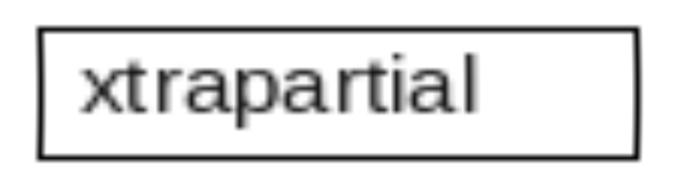

# xtrapartial



A round-based, movement-first arena FPS. Two players duel through short rounds on a rotation of small, surreal, early-2000s-styled maps, spawning with only their fists and racing for weapons scattered around each one. A precise shot to the heart kills instantly.

**Status:** pre-production. Milestone M1 (movement prototype) is playable, and the first six guns are in with a shooting range to try them on.

- [Game Design Document](docs/GDD.md)

## Running the prototype

1. Install **Godot 4.7.2**, the standard build (not .NET): <https://godotengine.org/download>
2. Clone this repo, open Godot, choose **Import**, and select `project.godot`.
3. Press **F5** to play. The main menu opens: **play → vs bots** sets up a game against bots on your machine: **free-for-all** (short rounds, three bots) or **teams** (a long four-against-four game: pick your gun with 1–6 in the countdown or while you're down; ammo boxes stand where the guns would be; kills close together chain into combos), with the game's options on a card to change as you like (health, round length, what it takes to win, the maps, the guns in play, what you spawn with, and more; remembered, and *defaults* puts them back). **Play → online** finds, hosts or joins a game over the network (below), and **sandbox** is the movement test course. In the bottom-right corner you type your name and pick your hat and your free-for-all colour; they're saved and worn in every game, and can be changed in a game from the pause menu (Esc). In the sandbox the gun pads are just to your left, and the shooting range is beyond them; its dummies play for blue. Press **F9** to step through the maps: Stack, Terrace, Switchback, Archipelago and Rift, then the team maps Boulevard, Holdfast and Depot ([GDD §9.3](docs/GDD.md#93-built-maps)). Stack, Terrace, Switchback, Rift and Boulevard are dressed: Stack as the drained rooftop pool of a hotel at night, Terrace as a dead mall's food court under a glass roof, in a total eclipse, Switchback as a car park stepping down a hill at dusk that carries on up into the sky, Rift as a mountain railway station above the clouds on a cloudy dawn, ringed by snowy peaks, Boulevard as a little village keeping warm in a great ice cave. The others are still greybox.

### Controls

| Action | Key |
|---|---|
| Move | WASD |
| Look | Mouse |
| Jump | Space or mouse wheel down |
| Slide / crouch (on the ground) | Ctrl or C |
| Smashdown (in the air) | Ctrl or C |
| Dash | Shift |
| Fire / aim down the sights | Left / right mouse (hold fire from the hip to fan the revolver) |
| Swap for the gun you're standing at | E (walking over one empty-handed takes it) |
| Throw your gun | Q |
| Switch gun / fists | 1 / 2, mouse wheel up |
| Tuning panel | F1 |
| Respawn | F2 |
| Toggle vsync | F3 |
| Toggle debug readout | F4 |
| Third-person camera (debug) | F6 |
| Die (debug, to see the death sequence) | F7 |
| Preview UI overlays (debug) | F8 |
| Next map | F9 |
| Scoreboard | Hold Tab |
| Pause menu | Esc |

Wall ride and mantle are automatic: jump along a wall to ride it, and move into a ledge to climb it. A dash leaves you faster: on the ground for a moment, and in the air much more (a dash at the top of a jump carries you about twice as far).

### Settings

**Settings** on the title screen or in the pause menu (Esc) has the usual settings, in tabs:

- **controls:** sensitivity, aim sensitivity, invert look, toggle aim.
- **keys:** rebind every action, two keys each. Click a slot and press a key or mouse button; Esc cancels, Backspace clears.
- **video:** window mode, vsync, frame cap, pixels (the 3D picture's height: 360 by default, *screen* for native), colours (an optional 16-bit colour and dither mode), and graphics to trade looks for speed: a quality preset (low / medium / high), shadows (off / low / high), extra lamps, detail, effects and bloom.
- **camera:** field of view, speed FOV, camera motion, smoothing, screen shake, wall ride tilt, UI motion, landing dip, speed lines, impact frames.
- **sound:** volume. There are no sounds yet.

Changes take effect at once and are saved in `user://settings.cfg` as you make them. Only what you've changed from the defaults is saved. **defaults** resets the open tab.

### Tuning

Press **F1** in-game to edit every movement value live. **Save** writes them to `data/movement_params.tres` when you run from the editor, so tuned values can be committed. The panel's View section is your settings (as above), and Save keeps those in `user://settings.cfg`.

## Playing online

Both ways run the same server-authoritative game ([how it works, and its safety model](docs/NETWORKING.md)):

- **Host from the menu.** *play → online → host a game*: name it, pick the style, the port (27960 by default) and optionally a password, and whether it's **public** (anyone can find it under *find a game*; it can still have a password). Friends on your network join at the address the lobby shows. To play over the internet, forward that UDP port on your router to your machine, or turn on *open the port* to ask the router to do it (UPnP, when the router allows it). In the lobby, add bots, change the game's rules under *options* (everyone sees them), then *start*. Everyone comes back to the lobby when the game ends.
- **Find a game.** *play → online → find a game* lists the public games on your network, and on a list server if you type one's address in (nobody runs one for the game yet: anyone can, below). Type to search by name, style or map; pick one to join (a locked one asks for its password).
- **Join by address.** *play → online → join by address*: the host's address (`192.168.1.20`, or `example.com:27961` for another port) and the password if there is one. If you leave a game, *rejoin* takes you back to it with your score, within 10 minutes. Your name, hat and colour can be changed in the pause menu mid-game, and everyone sees it.
- **Run a dedicated server.** No window, no player, games back to back while anyone's connected:

  ```sh
  godot --headless --path . -- --server --mode teams --maps boulevard,depot --password secret
  ```

  Add `--public` to make it findable (and `--list <address>` to keep it on a list server), and change the game's options with flags like `--health 150 --round-time 90 --guns rifle,sniper`. Settings can go in a config file instead (`--config server.cfg`), any of the game's options in its `[rules]` section; [`docs/server.example.cfg`](docs/server.example.cfg) lists and explains them all.
- **Run a list server**, so public games can find each other over the internet: `godot --headless --path . -- --list-server` (TCP 27950). Hosts and players type its address under *list server* ([NETWORKING.md](docs/NETWORKING.md#finding-games)).

**Know the risks.** Whoever hosts or runs a server decides the game and can cheat or log what you send; direct connections show everyone's IP address to the host (and the host's to everyone, and a public game's to anyone who looks); game traffic isn't encrypted; and no anti-cheat stops aim assistance. Play on hosts and servers you trust, and host only for people you know. The full list, and what the game does about each, is in [NETWORKING.md](docs/NETWORKING.md#security).

## Project layout

| Path | Contents |
|---|---|
| `src/movement/` | The movement simulation: `MovementSim` (one fixed tick), `MovementState`, `MovementParams`, `InputCommand` |
| `src/player/` | `Player` (input, camera interpolated between ticks), `PlayerModel` (the body, its holds, hit reactions and crumble), `BodyLayers` (clips over some bones, arm IK, hit flinches), `Viewmodel` (first-person arms and gun), `BodyShape` (proportions and shape), `DeathSequence` (the death cinematic), `Heart` (the heart: glowing beads going round in a pocket in the chest), `ViewSettings` |
| `src/cosmetics/` | `Hats` (every hat, built from primitives in team colours, and the no-hat team triangle) and `Cosmetics` (the saved pick) |
| `src/combat/` | The roster (`Weapons`, `WeaponDef`), gun models (`WeaponModel`), a player's hands (`WeaponHolder`: firing, pickups, throwing), shots in flight (`Ballistics`), hit zones (`HitShapes`), pickups and pads, ammo boxes (`AmmoBox`, teams), `TargetDummy`, and shooting effects |
| `src/ui/` | The UI: style and motion kit (`LofiUI`, `LofiSlider`), low-res canvas (`LofiLayer`), HUD and its ammo column, crosshair and ammo ring, overlays, pause and main menus, the vs bots page (`BotsMenu`) and the game's options card (`RulesEditor`), the online page and lobby (`OnlineMenu`), the settings page (`SettingsMenu`) and what it saves (`Settings`), scene wipe |
| `src/game/` | Games: `GameRules` (the free-for-all and teams presets), `Match` (runs a game across maps), `Game` (starts and ends one), `PlayerInfo` (each player's name, side and score), `BotBrain` (practice bots) |
| `src/net/` | Online play: `NetSession` (host, join, handshake, roster), `DedicatedServer`, finding public games (`ServerList`, `ServerAdvert`, `ServerBrowser`, and the list server `MasterServer`), `MatchSync` (a networked game's messages), `Prediction` and `Puppet` (your player and everyone else on a client), `Rewind` (lag compensation), `NetCodec` (the wire format, checked) |
| `src/world/` | `GreyBox` blocks (size, surface kind, or a dressed map's own surface), `Maps` (the map list F9 steps through), `AmbientZone` (an indoor zone the sky's light stays out of), `Graphics` (the graphics settings, applied to a level) and `Flicker` (a failing lamp) |
| `src/render/` | Surface, sky, screen, prop and viewmodel shaders, `RetroScreen` (low-res rendering), and the decor's shaders in `deco/` (glowing fittings, water, puddles, light shafts, city windows, a telly, the skyline, floating props) |
| `assets/` | Pixel textures, the reflection map, the logo, the generated body and chunk meshes, and third-party assets |
| `src/debug/` | Debug HUD and the live tuning panel |
| `data/` | Tuning resources |
| `scenes/` | `main_menu.tscn` (main scene), `test_course.tscn`, `player.tscn`, and the maps in `maps/` |
| `tests/` | Headless movement, UI, combat, cosmetics, map, game and network tests, and the online tests (real processes talking over the network) |
| `site/` | The website (below) |
| `tools/` | Test runner, the website's build script, the scene generator, the decor kit that dresses a map (`deco_kit.gd`, with `sign_kit.gd` for its signs and each dressed map's `<map>_deco.gd`), the level kit (with `level_side.gd` for symmetric team maps) and the map layouts (`maps/`) |

## Tests

```sh
tools/run_tests.sh
```

This runs the headless movement, UI, combat, cosmetics, map, game and network tests (the map tests drive a player through each map's routes), then the online tests in real time: a dedicated server started in a second Godot process, this one joining it (and a third joining late), then this one hosting a game a friend's process joins. `SKIP_ONLINE=1` skips those. Set `TEST_ONLY` to part of a test's name to run just those. It uses `$GODOT` or `godot` on your PATH; on Linux x86_64 it downloads Godot 4.7.2 into `.tools/` if neither is found.

`tools/build_scenes.gd` regenerates the input map, `player.tscn`, the greybox test course, and the maps (each laid out by a script in `tools/maps/` with the kit in `tools/level_kit.gd`). Once you edit the course by hand in the editor, stop regenerating it (pass `-- --skip-course`). `tools/gen_textures.gd` and `tools/gen_logo.gd` regenerate the placeholder textures and the logo, and `tools/gen_stack_textures.gd` and `tools/gen_terrace_textures.gd` the dressed maps' (both paint with `tools/texture_painter.gd`); paint over the PNGs freely instead. `tools/gen_body.gd` regenerates the player's body and its pre-diced chunks from `src/player/body_shape.gd` (about a minute; add `-- --body-only` to skip the dicing while tuning the shape).

## Website

`site/` is the game's website: one screen, drawn small on a canvas and blown up in hard pixels like the game's 3D, with the game's boxes: the logo, what the game is (in Arial), download buttons for pc, mac and the server build, and a picture card you can flip through, with the player hanging upside down from the top. The words and buttons are plain HTML in `site/index.html`, laid over the canvas unseen so links, the keyboard and screen readers work, and shown as plain boxes without JavaScript.

- **Downloads:** put each build's address in its button's `href` (the latest release's files, set once: [docs/RELEASING.md](docs/RELEASING.md)). Until then they say *soon :)*. Each button's `title` is its tooltip, shown in the site's own box when you point at it, with the build and the version.
- **The version:** the tag under the logo, stamped in by the build from `project.godot` (`application/config/version`, the one place it's set; the title screen shows it too). Every full release bumps it: [docs/RELEASING.md](docs/RELEASING.md) has the checklist.
- **Pictures:** list them in the picture card's `data-shots` (files in `site/shots/`: the dressed maps, 640 × 360, as the game draws them, with players posed in them). They're drawn small, so they come out pixelated like everything else. With none it shows stand-ins.

`tools/build_site.sh` puts it together in `_site/` with the logo, the icon and the font from `assets/` and the version from `project.godot`; to look at it locally:

```sh
tools/build_site.sh && python3 -m http.server -d _site
```

`.github/workflows/pages.yml` publishes it to GitHub Pages whenever it (or the version) changes on `main`. It needs, once, **Settings → Pages → Build and deployment → Source: GitHub Actions** in the repository. `tools/gen_icon.gd` makes the favicon (*xpl*, in the logo's style), and `tools/gen_site_figure.gd` renders the hanging player (`site/assets/figure.png`) from the game's own body; it needs a real renderer, so run it under `xvfb-run` with `--rendering-driver opengl3` on a machine without a screen.

## Known issues

- **The OpenGL fallback runs out of per-object colour slots on the big maps.** Surfaces, props and guns set their colour and gloss per object (instance shader parameters). Godot's Forward+ renderer (Vulkan, the default) has room for thousands of them; the Compatibility renderer (OpenGL, used when Vulkan isn't available, or with `--rendering-driver opengl3`) fits about 256 objects (4096 slots), and a full eight-player team game on Depot or Holdfast goes past that: some objects lose their colours and Godot prints "Too many instances using shader instance variables". Use Forward+ for now; the fix is to move those colours into shared materials.
- **Online play hasn't been tested over a real network yet**, only on one machine. See [NETWORKING.md](docs/NETWORKING.md#known-limits) for what's not done and what to expect.

## Credits

- Animations: [Universal Animation Library](https://quaternius.com/packs/universalanimationlibrary.html) by Quaternius, CC0 (`assets/third_party/quaternius_ual/`).
- Fonts (`assets/fonts/`): Liberation Sans, Serif and Mono, SIL Open Font License 1.1 (`LICENSE-LiberationSans.txt`); DejaVu Sans Bold and DejaVu Serif Bold, the Bitstream Vera licence (`LICENSE-DejaVu.txt`).
